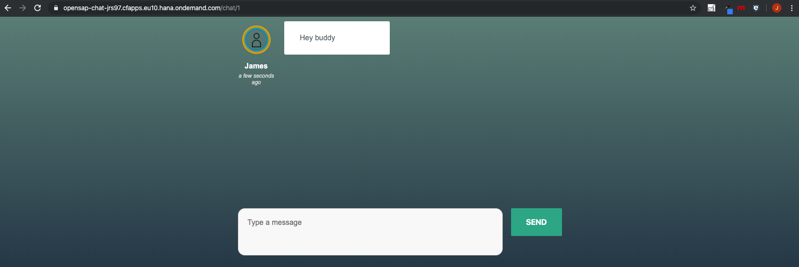

# NodeJS Chat Application

## Description: 
This is a simple chat application that is built on NodeJS. It uses socket.io library which enables real-time, event-based communication. It shows how socket.io rooms can be used to create different chat rooms.
This application can be run locally as well as on Cloud Foundry landscape.  

# My Changes
* Clone the repo.
* Edit the manifest.yml - change the "host" to "openSAP-chat-jrs97".
* cf login to the SAP trial env -> $ cf login -a https://api.cf.eu10.hana.ondemand.com 
* cf push from the app's directory.
* cf apps to get the URL.
* Have a play.
* cf delete <app-name> when you're done.



Features:
* Login with name, email id.
* Chat with a user who has logged into the same chat room. 
* Only 2 people are allowed per room. If more people enter, they will be directed to a different room.

## Requirements
- [Node js](https://nodejs.org/en/download/)
- [Cloud Foundry Command Line Interface (CLI)](https://github.com/cloudfoundry/cli#downloads)
- Cloud Foundry trial or enterprise account, [sign up for a Cloud Foundry environment trial account on SAP Cloud Platform](https://help.sap.com/viewer/65de2977205c403bbc107264b8eccf4b/Cloud/en-US/76e79d62fa0149d5aa7b0698c9a33687.html)
   
## Download and Installation
Running the application

1. [Clone](https://help.github.com/articles/cloning-a-repository/) this repository
2. Login to Cloud Foundry by typing the below commands on command prompt
    ```
    cf api <api>
    cf login -u <username> -p <password> 
    ```
    `api` - [URL of the Cloud Foundry landscape](https://help.sap.com/viewer/65de2977205c403bbc107264b8eccf4b/Cloud/en-US/350356d1dc314d3199dca15bd2ab9b0e.html) that you are trying to connect to.
    
    `username` - Email address of your sap.com account.
    `password` - Your sap.com password
    
    Select the org and space when prompted to. For more information on the same refer [link](https://help.sap.com/viewer/65de2977205c403bbc107264b8eccf4b/Cloud/en-US/75125ef1e60e490e91eb58fe48c0f9e7.html#loio4ef907afb1254e8286882a2bdef0edf4).
    
3. Edit Manifest

   Open the manifest.yml file and replace <I/D/C numbers> placeholder with your *SAP User ID* so that the host name is unique in the CF landscape. You can find your *SAP User ID* in [your sap.com profile](https://people.sap.com/#personal_info).

4. Push the application

    ```cf push```
5. Once the application has been pushed successfully, open the URl in a web browser. 
You can test by opening the same chat room in different browser tabs. 

## Known Issues
No known issues.

## How to Obtain Support

In case you find a bug, or you need additional support, please open an issue here in GitHub.

## License

Copyright (c) 2018 SAP SE or an SAP affiliate company. All rights reserved. This file is licensed under SAP Sample Code License Agreement, except as noted otherwise in the [LICENSE](/LICENSE) file.
